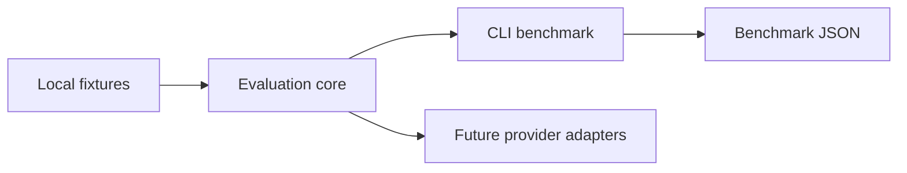

# #10 prompt-ab-testing

**Claim:** Prompt A/B testing harness that scores variants, ranks winners, and reports a reproducible confidence interval.

**Benchmark:** `best_variant_score` = `1.0` on local deterministic fixtures. Result file: `benchmarks/results/prompt-ab-baseline.json`.

## What It Proves

This repository is part of **AI Evaluation and Retrieval Systems**. It provides one measurable layer of the AI Evaluation & RAG Platform while keeping the default path local-first, Dockerized, and free of paid credentials.

## Architecture



Dependency rule: evaluation core does not import provider SDKs, cloud SDKs, web frameworks, or GitHub automation.

## Run Locally

```powershell
$env:PYTHONPATH = "src"
python -m prompt_ab_testing benchmark --output benchmarks/results/prompt-ab-baseline.json
```

## Run With Docker

```powershell
docker build -t prompt-ab-testing .
docker run --rm prompt-ab-testing
```

## Benchmark Result

See `benchmarks/results/prompt-ab-baseline.json`.

## Reuse Contract

- Uses `portfolio-reuse-kit` for agent graph, SDD, validation, design system, and publication gate.
- Records reusable improvement decisions in `sdd/reuse-improvement-review.md`.
- Runs without paid secrets by default.
