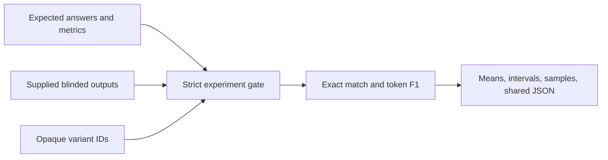

# #10 prompt-ab-testing

**Benchmark:** highest blinded mean score `0.9365` for `v_01` across four cases; its sample-wise 95% interval is `[0.8635, 1.0]`.

**Claim:** A local-first prompt experiment evaluator that scores supplied variant outputs against deterministic expected answers without multipliers, prompt labels, provider calls, or a predetermined winner.

## What It Proves

The repository proves a reproducible evaluation boundary for prompt experiments. Cases declare either normalized exact match or token F1. Outputs are supplied separately, every case/variant pair is required, and only opaque IDs such as `v_01` enter scoring and reports.

The leader is derived from output quality. Changing the supplied outputs can change the leader; ties are reported as multiple `leading_variant_ids` instead of being broken arbitrarily.

## Input Contract

- `data/fixtures/variants.json`: `blinded: true` and at least two opaque variant IDs.
- `data/fixtures/cases.jsonl`: case ID, deterministic metric, and expected answer.
- `data/fixtures/outputs.jsonl`: one supplied output for every case and variant.

Malformed IDs, unblinded metadata, duplicates, unknown records, and incomplete experiment matrices fail validation.

## Architecture



Scoring is independent from prompt generation and provider SDKs. Any local or cloud runner can produce the output matrix without entering the evaluation core.

## Run Locally

```powershell
$env:PYTHONPATH = "src"
python -m prompt_ab_testing benchmark --cases data/fixtures/cases.jsonl --outputs data/fixtures/outputs.jsonl --variants data/fixtures/variants.json --output benchmarks/results/prompt-ab-baseline.json
```

## Run With Docker

```powershell
docker build -t prompt-ab-testing .
docker run --rm prompt-ab-testing
```

The result follows `.portfolio/contracts/benchmark-result.schema.json` and is committed at `benchmarks/results/prompt-ab-baseline.json`.

## Scope

The four-case fixture demonstrates the harness, not statistical significance or general prompt superiority. The reported interval is a normal approximation over case scores and remains wide for small samples. Production experiments should add representative cases before selecting a prompt.
