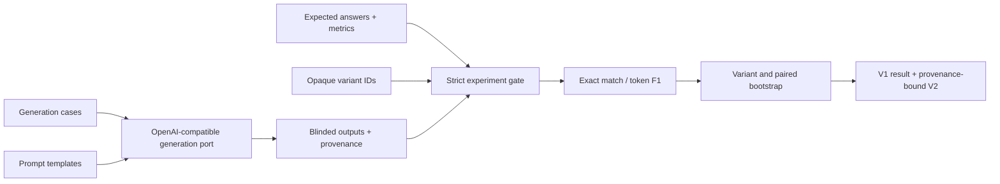

# #10 prompt-ab-testing

**Benchmark:** on `30` real local-LLM responses, concise variants `v_02` and `v_03` scored `0.80`, versus `0.00` for explanatory baseline `v_01`; paired uplift was `+0.80` with bootstrap 95% CI `[0.50, 1.00]`.

**Claim:** A local-first prompt experiment that generates responses through a pinned OpenAI-compatible model adapter, then evaluates a complete blinded matrix with deterministic metrics and paired uncertainty.

## What It Proves

The repository separates two responsibilities. The producer calls a model and emits provider-neutral output records plus provenance. The evaluator reads only opaque IDs such as `v_01`, expected answers, and supplied outputs; it does not know prompt semantics or import a provider SDK.

The measured result is intentionally narrow: concise extraction instructions improved exact-answer compliance over a prompt asking for explanatory sentences. The two concise prompts tied, so this benchmark does not claim one is generally superior.

## Benchmark Evidence

| Measure | Result |
|---|---:|
| Model | `qwen2.5-coder:0.5b` |
| Model digest | `sha256:4ff64a7...3fb09` |
| `v_01` explanatory baseline | `0.00` |
| `v_02` concise extraction | `0.80` |
| `v_03` exact phrase extraction | `0.80` |
| Concise vs baseline uplift | `+0.80` |
| Paired uplift 95% CI | `[0.50, 1.00]` |
| Measured model responses | `30` |
| Generation failures | `0` |
| Generation p95 | `941.55 ms` |

Ten cases and three variants produce 30 measured responses. Each variant uses 10,000 seeded bootstrap resamples. The local Ollama run consumed `2,158` prompt tokens and `262` completion tokens after one excluded warmup request.

## Contracts

- `generation-cases.jsonl`: model-visible context and question, without expected answers.
- `prompt-templates.json`: prompt text mapped to opaque variant IDs.
- `outputs.jsonl`: exactly one generated output for every case and variant.
- `outputs.provenance.json`: provider, model digest, producer commit/image, token counts, latency, and artifact hashes.
- `cases.jsonl`: evaluator-only expected answer and deterministic metric.

Malformed IDs, template mismatches, duplicate or missing outputs, empty model responses, and incomplete matrices fail closed.

## Architecture



The outer adapter depends on the generation port. The scoring core depends only on experiment records. Ollama can be replaced by another OpenAI-compatible endpoint without changing evaluation policy.

## Run

Evaluate the committed real outputs offline:

```powershell
docker build -t prompt-ab-testing .
docker run --rm --network none prompt-ab-testing
```

Regenerate through a local Ollama container on the same Docker network:

```powershell
docker run --rm --network wia_wia_infer `
  -e PROMPT_AB_BASE_URL=http://wia-ollama:11434/v1 `
  -e PROMPT_AB_MODEL=qwen2.5-coder:0.5b `
  -e PROMPT_AB_MODEL_DIGEST=sha256:4ff64a7f502a08b7616edb8ca0a79eb1853fc363d842b7df4b46915d11a3fb09 `
  prompt-ab-testing generate
```

## Validate

```powershell
$env:PYTHONPATH = "src"
python -m unittest discover -s tests -v
./tools/validate-project.ps1
```

Raw evidence is committed at `benchmarks/results/prompt-ab-baseline.json`; schema-validated publication evidence is at `benchmarks/publication/prompt-ab-baseline-v2.json`.
