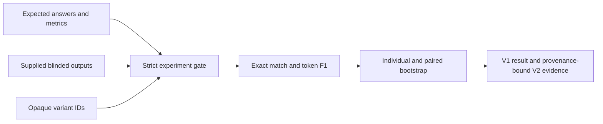

# #10 prompt-ab-testing

**Benchmark:** apparent leader `v_01` scored `0.9365`; paired uplift over `v_02` was `0.2222` with bootstrap 95% CI `[-0.0833, 0.75]`, so the four-case result is **inconclusive**.

**Claim:** A local-first, provider-neutral evaluator for complete blinded prompt-output matrices, with deterministic task metrics and paired uncertainty instead of a predetermined winner.

## What It Proves

The repository enforces a reproducible boundary between prompt generation and evaluation. Cases declare normalized exact match or token F1, outputs arrive through a separate file, and every case/variant pair must exist. Scoring sees only opaque IDs such as `v_01`.

The apparent leader is derived from supplied outputs. Replacing those outputs can change the leader. Ties remain ties, and a leader is not called conclusive unless the paired bootstrap uplift interval is strictly above zero.

## Benchmark Evidence

| Measure | Result |
|---|---:|
| Apparent leader mean | `0.9365` |
| Leader bootstrap 95% CI | `[0.873, 1.0]` |
| Paired uplift over runner-up | `0.2222` |
| Paired uplift 95% CI | `[-0.0833, 0.75]` |
| Conclusion | `inconclusive` |
| Measured output scores | `12` |
| Independent process runs | `1` |

Intervals use all `4^4 = 256` exhaustive case resamples. `repeat=1` describes process execution; `measured_iterations=12` describes four cases scored for three variants. The fixture demonstrates the harness and does not establish general prompt superiority.

## Input Contract

- `data/fixtures/variants.json`: `blinded: true` and at least two opaque variant IDs.
- `data/fixtures/cases.jsonl`: case ID, deterministic metric, and expected answer.
- `data/fixtures/outputs.jsonl`: one supplied output for every case and variant.

Malformed IDs, unblinded metadata, duplicates, unknown records, and incomplete matrices fail before a result is written.

## Architecture



The functional core depends on experiment records, not provider, cloud, transport, or billing SDKs. Local and cloud prompt runners can implement the same output contract without changing evaluation policy.

## Run

```powershell
$env:PYTHONPATH = "src"
python -m prompt_ab_testing benchmark --output benchmarks/results/prompt-ab-baseline.json
```

```powershell
docker build -t prompt-ab-testing .
docker run --rm --network none prompt-ab-testing
```

## Validate

```powershell
python -m unittest discover -s tests -v
./tools/validate-project.ps1
```

The raw result is `benchmarks/results/prompt-ab-baseline.json`. Published schema-validated evidence is committed at `benchmarks/publication/prompt-ab-baseline-v2.json`, binding the result to the clean source commit, exact Docker image, committed fixtures, benchmark config, and validation lock.