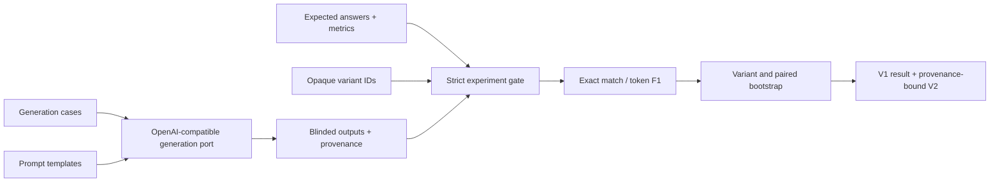

# Prompt A/B Testing: Blinded, Paired Experiments on a Local LLM

**Concise prompt variants scored `0.80` versus `0.00` for the explanatory baseline** on `30` real local-LLM responses, a paired uplift of `+0.80` with bootstrap 95% CI `[0.50, 1.00]`. The evaluator never sees prompt text, only opaque variant IDs.

[](https://github.com/Brilhante29/prompt-ab-testing/actions/workflows/validate.yml)
[](LICENSE)


## Why this exists

Prompt changes are usually shipped on vibes: someone tries three inputs, likes the new wording, and merges. That hides two problems. The person judging knows which prompt is which, and nobody reports how uncertain a difference on ten cases really is. This repository runs prompt changes like a small, honest experiment:

- the producer calls the model and writes blinded outputs plus provenance (model digest, producer commit and image, token counts, latency, artifact hashes);
- the evaluator reads only opaque IDs (`v_01`, `v_02`, ...), expected answers, and outputs; it cannot import a provider SDK or read prompt semantics;
- every case-variant pair must be present exactly once, or the run fails closed;
- differences are reported as paired uplift with a seeded bootstrap confidence interval, not as a single average.

## Results

| Measure | Result |
|---|---:|
| Model | `qwen2.5-coder:0.5b` |
| Model digest | `sha256:4ff64a7...3fb09` |
| `v_01` explanatory baseline | `0.00` |
| `v_02` concise extraction | `0.80` |
| `v_03` exact phrase extraction | `0.80` |
| Concise vs baseline uplift | `+0.80` |
| Paired uplift 95% CI | `[0.50, 1.00]` |
| Measured model responses | `30` |
| Generation failures | `0` |
| Generation p95 | `941.55 ms` |

Ten cases times three variants give 30 measured responses; each variant uses 10,000 seeded bootstrap resamples. The run consumed `2,158` prompt and `262` completion tokens after one excluded warm-up request.

**How to read it:** the claim is deliberately narrow. Asking for concise extraction improved exact-answer compliance over asking for explanatory sentences, which exact match penalizes by construction. The two concise prompts tied, so the experiment does not claim either is generally better; the confidence interval is wide because ten cases is a small sample.

## Quickstart

Evaluate the committed real outputs offline:

```bash
docker build -t prompt-ab-testing .
docker run --rm --network none prompt-ab-testing
```

Regenerate outputs through a local Ollama container:

```bash
docker network create llm-local
docker run -d --name ollama --network llm-local ollama/ollama
docker exec ollama ollama pull qwen2.5-coder:0.5b
docker run --rm --network llm-local \
  -e PROMPT_AB_BASE_URL=http://ollama:11434/v1 \
  -e PROMPT_AB_MODEL=qwen2.5-coder:0.5b \
  -e PROMPT_AB_MODEL_DIGEST=sha256:4ff64a7f502a08b7616edb8ca0a79eb1853fc363d842b7df4b46915d11a3fb09 \
  prompt-ab-testing generate
```

Tests:

```bash
PYTHONPATH=src python -m unittest discover -s tests -v
```

## How it works


```mermaid
flowchart LR
  Input["Generation cases"] --> Port["OpenAI-compatible generation port"]
  Prompt["Prompt templates"] --> Port
  Port --> Artifact["Blinded outputs + provenance"]
  Expected["Expected answers + metrics"] --> Gate["Strict experiment gate"]
  IDs["Opaque variant IDs"] --> Gate
  Artifact --> Gate
  Gate --> Core["Exact match / token F1"]
  Core --> Stats["Variant and paired bootstrap"]
  Stats --> Evidence["V1 result + provenance-bound V2"]
```

| Contract file | Contents |
|---|---|
| `generation-cases.jsonl` | Model-visible context and question, without expected answers |
| `prompt-templates.json` | Prompt text mapped to opaque variant IDs |
| `outputs.jsonl` | Exactly one generated output per case and variant |
| `outputs.provenance.json` | Provider, model digest, producer commit and image, tokens, latency, hashes |
| `cases.jsonl` | Evaluator-only expected answers and metric |

## Design decisions

| Decision | Why | Rejected |
|---|---|---|
| Separate producer and blinded evaluator | Scoring cannot be biased by knowing the prompt | One script that generates and grades |
| Paired bootstrap CI | Same cases across variants; honest uncertainty on small samples | Reporting mean differences alone |
| Fail closed on incomplete matrices | A missing output would bias the comparison | Averaging whatever exists |
| OpenAI-compatible port, local model by digest | Reproducible, free, swappable provider | Hard-coded vendor SDK |

## Limitations

- Ten cases; the interval `[0.50, 1.00]` is wide by design of the sample size.
- Deterministic lexical metrics (exact match, token F1) reward format compliance, not reasoning quality.
- One small local model; conclusions do not transfer automatically to larger models.

## Reproducibility

- Raw evidence: [`benchmarks/results/prompt-ab-baseline.json`](benchmarks/results/prompt-ab-baseline.json).
- Schema-validated publication evidence: [`benchmarks/publication/prompt-ab-baseline-v2.json`](benchmarks/publication/prompt-ab-baseline-v2.json).

## Project structure

```text
src/prompt_ab_testing/   producer (generation port) and CLI with the scoring core
tests/                   experiment gate, metrics, and bootstrap tests
data/fixtures/           cases, templates, blinded outputs, provenance
benchmarks/              raw results and V2 publication evidence
sdd/  openspec/          specification, architecture and technical decisions
```

## How this repository is built

The project follows the spec-driven workflow of [portfolio-reuse-kit](https://github.com/Brilhante29/portfolio-reuse-kit). Requirements and decisions live in [`sdd/`](sdd) and [`openspec/`](openspec), and [`project.yaml`](project.yaml) records the architecture, stack, and rejected alternatives. Development is AI-assisted and human-governed: [`AGENTS.md`](AGENTS.md) and [`CLAUDE.md`](CLAUDE.md) hold the coding-agent instructions, while tests, validators, and CI decide what gets published.

## Related work

- [llm-eval-harness](https://github.com/Brilhante29/llm-eval-harness): contract-first scoring of RAG and LLM outputs.
- [llm-agent-eval](https://github.com/Brilhante29/llm-agent-eval): trace-level evaluation of a tool-using agent.
- [cost-aware-inference](https://github.com/Brilhante29/cost-aware-inference): what local versus hosted inference costs in latency and money.

See [`REFERENCES.md`](REFERENCES.md) for attribution.

## Author

**Guilherme Brilhante**, software engineer working on scalable backends and production AI.
[LinkedIn](https://www.linkedin.com/in/guilhermefreirebrilhanteseveriano/) · [GitHub](https://github.com/Brilhante29) · [Publications](https://dblp.org/pid/353/6812.html)

## License

[MIT](LICENSE).
